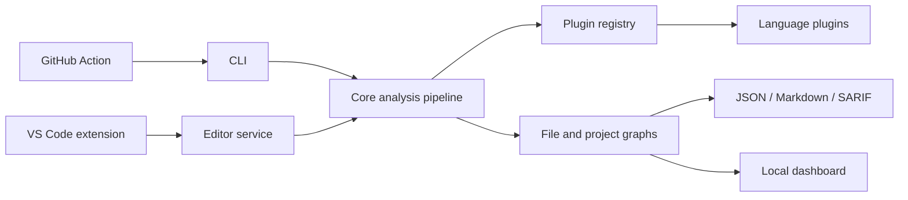
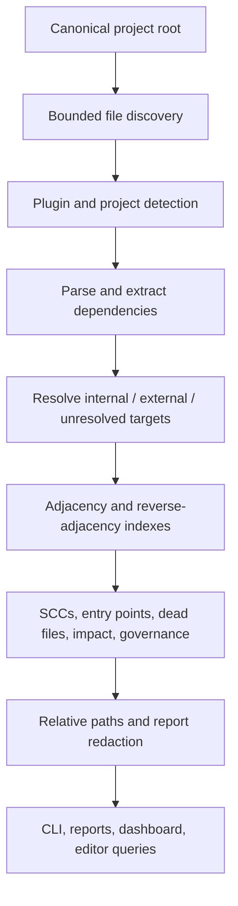
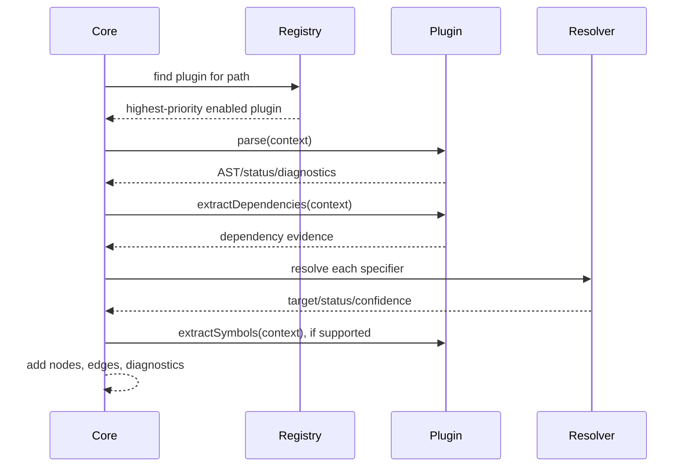

# Architecture and data flow

## Components

## Analysis data flow

Cascade reads source and build metadata as data. It does not intentionally run
analyzed source or build configuration.

## Plugin lifecycle

Plugin calls are exception-isolated, but third-party plugins execute in-process
and are trusted code. See [Plugin development](PLUGIN_DEVELOPMENT.md) and
[Security](SECURITY.md).
