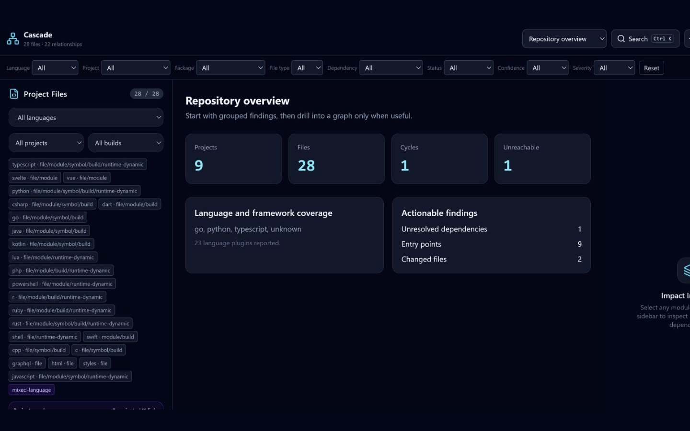

# Dashboard

The dashboard is a local interface for exploring repository, project, file, package, service, cycle, dead-code, impact, test, architecture, unresolved-dependency, language, hotspot, matrix, and snapshot views.



## Start

```bash
pnpm run build
node packages/cli/dist/index.js dashboard .
node packages/cli/dist/index.js dashboard . --base main --head HEAD
```

The server binds to `127.0.0.1`, chooses port 4000 or an available fallback, and opens a tokenized URL. It remains active until the CLI process stops.
Use `--no-open` for scripted capture and `--output <file>` to retain the exact
dataset. Supplying `--base` attaches Git change impact, affected tests, and risk
evidence to the pull-request dashboard views.
Use `--output-only` with `--output` when generating a dataset without starting
the local server.

## Interaction

- Use `Ctrl+K` or `Cmd+K` for the command palette.
- Search matches relative file paths, extracted symbol names, package/workspace names,
  project names, languages, and workspace views when those fields are present in the report.
- Filter by language, project, package, file type, dependency type, status,
  confidence, and governance severity.
- Select nodes for direct and transitive impact.
- Use the inspector's Imports and Dependents tabs to navigate in either direction.
- Select an affected item to show the shortest directed evidence path when one exists.
- Select edges to inspect source, target, dependency type, resolution status,
  resolver and plugin provenance, confidence, plugin analysis level, evidence, and
  an unresolved reason. Older reports show `not supplied` rather than synthesizing data.
- Use project views for an aggregated monorepo perspective.

All native controls are reachable by keyboard. Graph nodes and controls use React
Flow's keyboard model; the surrounding navigation, filters, search results,
inspectors, and export actions use semantic buttons, labels, dialogs, and live
status messages. The layout collapses both inspectors into labelled mobile drawers
below the desktop breakpoint.

## Report states and compatibility

The browser validates the report before rendering it. Schema versions `1.0` and
`2.0` are accepted for backward compatibility. Invalid JSON, missing required
collections, invalid node/edge records, and unknown schema versions display a
specific error with a retry action.

- **Loading** reports that the local snapshot is being loaded; it does not imply
  that repository analysis is executing in the browser.
- **Empty** means the report is valid but contains no analyzable file nodes. The
  UI suggests checking the target, ignore rules, and language support.
- **Partial** appears when warnings, diagnostics, failed parses, or partial parses
  are present. All available results remain navigable and are explicitly described
  as incomplete.
- **Complete** means none of those partial indicators were supplied. It is not a
  claim that static analysis is exhaustive.


## Scale behavior

File graph layout selects at most 400 highest-connected nodes, project graphs at
most 800, and the dependency matrix at most 200. The bounds are hard safeguards:
the dashboard does not offer an unbounded “render all” action. A selected node is
retained in the bounded graph. File lists show at most 500 matches, general result
views show at most 2,000 rows, and both tell the user to refine search or filters.
These limits protect layout, DOM size, and memory while preserving access to the
complete report through search and export.

Hotspot preprocessing builds degree indexes in `O(nodes + edges)` time. Graph
selection uses a bounded degree aggregation before Dagre layout, so a 50,000-node
fixture cannot create a 50,000-node canvas.

JSON and self-contained HTML exports contain the complete, browser-sanitized
analysis payload. SVG and PNG contain only factual summary counts. PDF uses the
browser print pipeline. Exports are local downloads/copies; the dashboard has no
upload, telemetry, public-link, or hosted sharing operation.

## Security

The dashboard serves analysis data and works offline; it does not execute
repository source or fetch runtime assets from a CDN. Repository strings are
rendered as React text, and the application does not use
`dangerouslySetInnerHTML`.

Core serialization changes `projectRoot` to `.`, makes graph paths relative, and
recursively removes the analyzed root. As defense in depth, browser validation
redacts Windows drive/UNC paths and common Unix home/temp absolute paths from all
displayed and exported strings. Treat exported dependency information as
potentially sensitive even after local paths are removed.

The server applies a random access token, an HTTP-only same-site cookie, no-store caching, a restrictive Content Security Policy, and other defensive headers. Do not proxy or expose it to a network. A hosted deployment would require a separate authentication, authorization, TLS, and data-retention design.

## Measured preprocessing

```bash
node benchmarks/dashboard-scale.mjs 50000
```

This measures JSON parsing and bounded degree aggregation, not browser paint. The
dashboard unit suite also enforces the 400/800/200/500 bounds and exercises a
50,000-node model fixture. See [Performance](PERFORMANCE.md).

## Verification

```bash
pnpm exec vitest run tests/unit/dashboardDataStates.test.ts tests/unit/dashboardComponents.test.ts tests/unit/dashboardContract.test.ts tests/unit/dashboardGraphModel.test.ts
pnpm --filter @cascade-code/dashboard run typecheck
pnpm --filter @cascade-code/dashboard run build
```

For a manual demo, run `node packages/cli/dist/index.js dashboard . --no-open`,
open the printed loopback URL, then verify search, graph node/edge selection,
Imports/Dependents navigation, cycle and violation views, export, `Ctrl`/`Cmd`+`K`,
and the mobile drawers at a narrow viewport.
