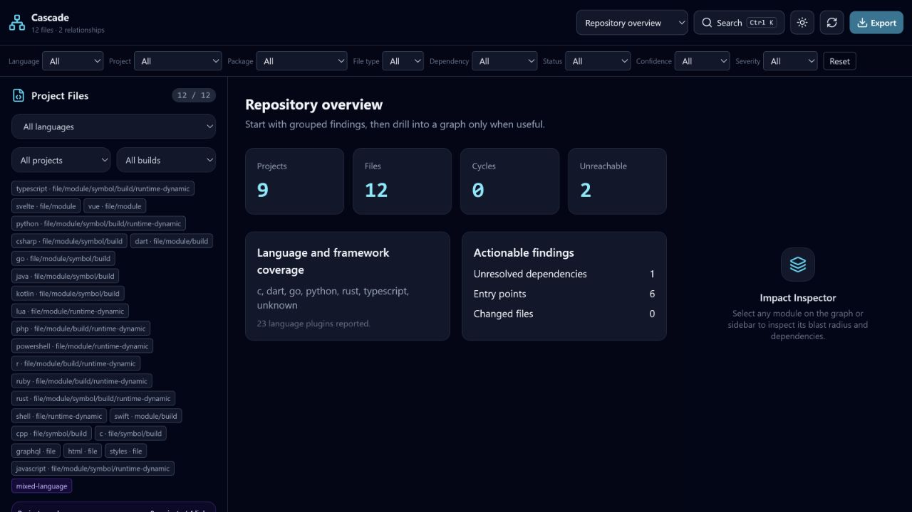
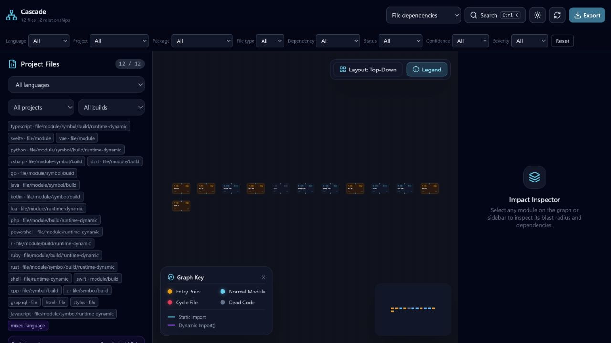

# Dashboard

The dashboard is a local interface for exploring repository, project, file, package, service, cycle, dead-code, impact, test, architecture, unresolved-dependency, language, hotspot, matrix, and snapshot views.



## Start

```bash
pnpm run build
node packages/cli/dist/index.js dashboard .
node packages/cli/dist/index.js dashboard . --base main --head HEAD
```

The server binds to `127.0.0.1`, chooses port 4000 or an available fallback, and opens a tokenized URL. It remains active until the CLI process stops.
Use `--no-open` for scripted capture and `--output <file>` to retain the exact
dataset. Supplying `--base` attaches Git change impact, affected tests, and risk
evidence to the pull-request dashboard views.
Use `--output-only` with `--output` when generating a dataset without starting
the local server.

## Interaction

- Use `Ctrl+K` or `Cmd+K` for the command palette.
- Filter before expanding a large graph.
- Select nodes for direct and transitive impact.
- Select edges to inspect type, confidence, resolution state, and evidence.
- Use project views for an aggregated monorepo perspective.



## Scale behavior

File graph layout initially selects at most 400 nodes, project graphs at most 800, and the dependency matrix at most 200. Expansion is explicit. These bounds protect browser layout and memory; they do not imply that rendering an entire 50,000-file graph is practical.

JSON and self-contained HTML exports contain the complete selected analysis payload. SVG and PNG capture visual overviews. PDF uses the browser print pipeline.

## Security

The dashboard serves analysis data; it does not execute repository source. Repository strings are rendered as React text, and the application does not use `dangerouslySetInnerHTML`.

The server applies a random access token, an HTTP-only same-site cookie, no-store caching, a restrictive Content Security Policy, and other defensive headers. Do not proxy or expose it to a network. A hosted deployment would require a separate authentication, authorization, TLS, and data-retention design.

## Measured preprocessing

```bash
node benchmarks/dashboard-scale.mjs 50000
```

This measures JSON parsing and bounded degree aggregation, not browser paint. See [Performance](PERFORMANCE.md).
