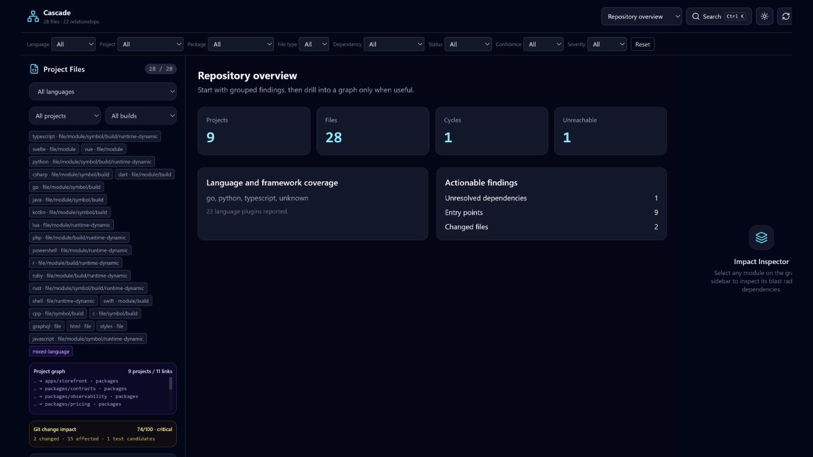

# Cascade Commerce demo



This fixture is a small, realistic polyglot commerce system designed to exercise
Cascade with facts the analyzer can reproduce. It contains a TypeScript
storefront, a Node.js API, a Python fulfillment worker, a Go notification
service, shared workspace packages, tests, and infrastructure configuration.

## What Cascade should find

| Story                      | Reproducible evidence                                                          |
| -------------------------- | ------------------------------------------------------------------------------ |
| Circular dependency        | `packages/pricing/src/discounts.ts` and `rules.ts` import each other           |
| Unreachable file           | `apps/storefront/src/legacy-banner.ts` is outside every entry-point path       |
| High-impact module         | `packages/contracts/src/order.ts` is imported across the web app and API       |
| Cross-package dependency   | `@cascade-demo/pricing` and `@cascade-demo/contracts` use workspace resolution |
| Architecture violation     | API domain code reaches into the storefront's feature flags                    |
| Unresolved internal import | `services/api/src/adapters/fraud.ts` imports a missing internal module         |
| Affected test              | Pricing tests import the changed pricing module and are also explicitly mapped |
| PR introduces a cycle      | Generated ref `pr/new-cycle` adds an audit/notification loop                   |
| PR removes dead code       | Generated ref `pr/remove-dead-code` deletes the unreachable banner             |

These are intentional teaching examples, not claims about production quality.
Cascade's output is generated from the real CLI and its stated confidence
model.

## Quick start

From the Cascade repository root:

```bash
node examples/cascade-commerce/scripts/setup-demo.mjs
node examples/cascade-commerce/scripts/generate-reports.mjs
node packages/cli/dist/index.js analyze .cascade-demo --compact --no-color
node packages/cli/dist/index.js dashboard .cascade-demo --base demo-base --head pr/new-cycle
```

`analyze` exits with status 1 when it finds a cycle or dead file. The demo
scripts treat that documented finding exit as success.

Run `node examples/cascade-commerce/scripts/verify-demo.mjs` to assert every
documented finding, both Git scenarios, all report formats, and the absence of
local absolute paths.

See [DEMO.md](DEMO.md) for the short recording flow and
[media-assets/README.md](media-assets/README.md) for capture details.
